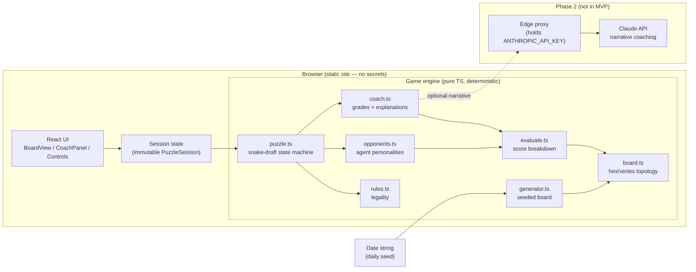
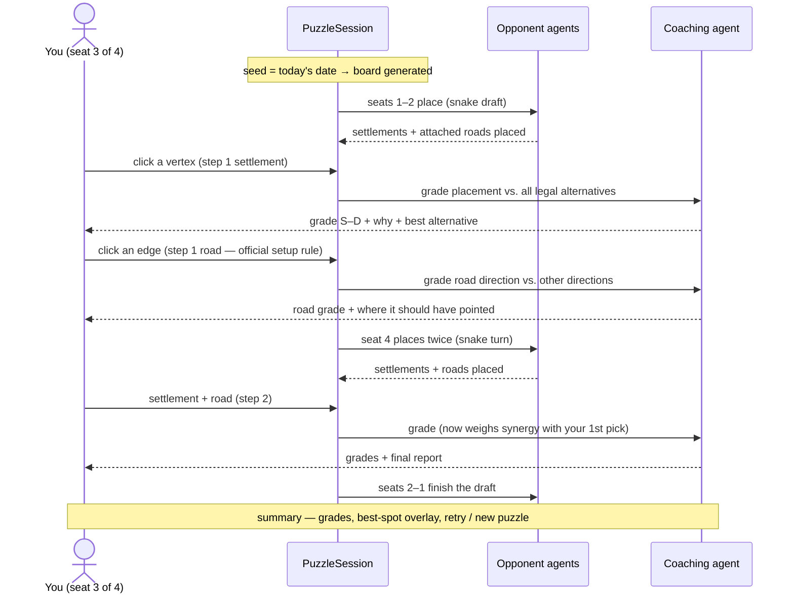
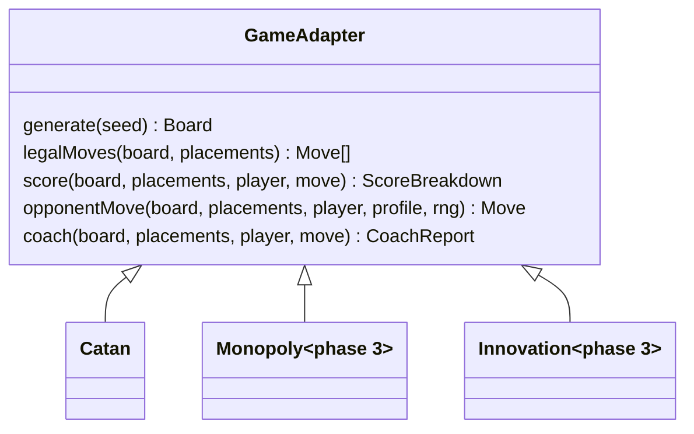

# Architecture

## System overview

Key property: **everything left of the dashed line is deterministic and secret-free.**
Same seed ⇒ same board, same opponent moves, same scores. That makes daily puzzles
shareable, tests reproducible, and the coach's advice explainable.

## Puzzle flow (multi-step)

## Engine module contract (game adapters)

Each game lives in `src/engine/<game>/` and exposes the same shape, so the UI and
puzzle shell stay game-agnostic:

## Catan board topology

Axial hex coordinates `(q, r)` with radius 2 → 19 hexes. Vertices use the canonical
`(q, r, N|S)` scheme (every vertex in a pointy-top hex grid is the **N**orth corner of
exactly one hex column position or the **S**outh corner of one), which gives exact
identity — no floating-point deduplication:

- Corners of hex `(q,r)`: `(q,r,N)`, `(q+1,r-1,S)`, `(q,r+1,N)`, `(q,r,S)`, `(q-1,r+1,N)`, `(q,r-1,S)`
- Hexes touching `(q,r,N)`: `(q,r)`, `(q,r-1)`, `(q+1,r-1)`
- Vertex neighbors of `(q,r,N)`: `(q,r-1,S)`, `(q+1,r-1,S)`, `(q+1,r-2,S)` (mirror for `S`)

The 30-vertex coast ring is walked to place the 9 ports (4× 3:1, 5× 2:1) with the
standard 1-1-2 gap rhythm.

## Scoring model (explainable by design)

`evaluate.ts` returns a **breakdown**, not just a number, so the coach can explain
every point:

| Component | Meaning |
|---|---|
| `pips` | Raw production (probability dots of adjacent tokens) |
| `weightedPips` | Pips weighted by board-wide scarcity of each resource |
| `diversityBonus` | New resource types this placement adds for the player |
| `comboBonus` | Completes brick+lumber (roads) or ore+grain (cities/dev) |
| `portBonus` | 3:1 or 2:1 port, scaled by matching production |
| `expansionBonus` | Nearby vertices still open for future settlements |

Opponent personalities reuse the same breakdown with different weightings; the
**blocker** additionally values a vertex by how much *you* wanted it.
